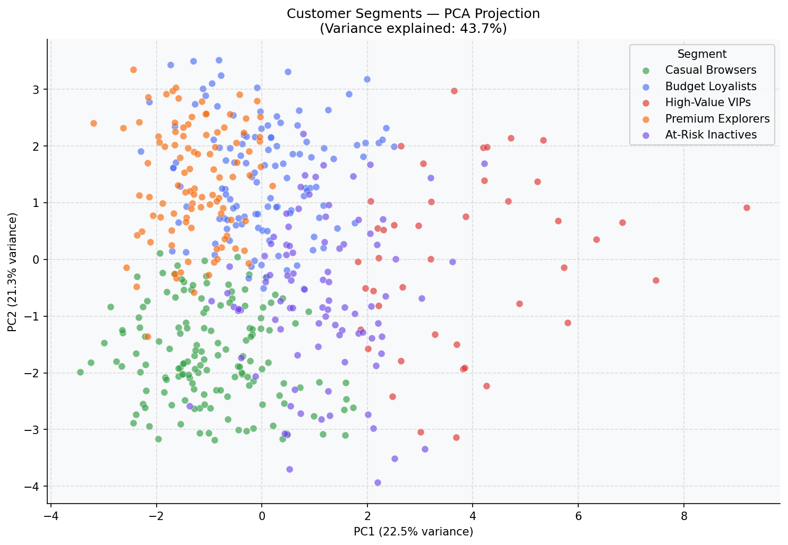
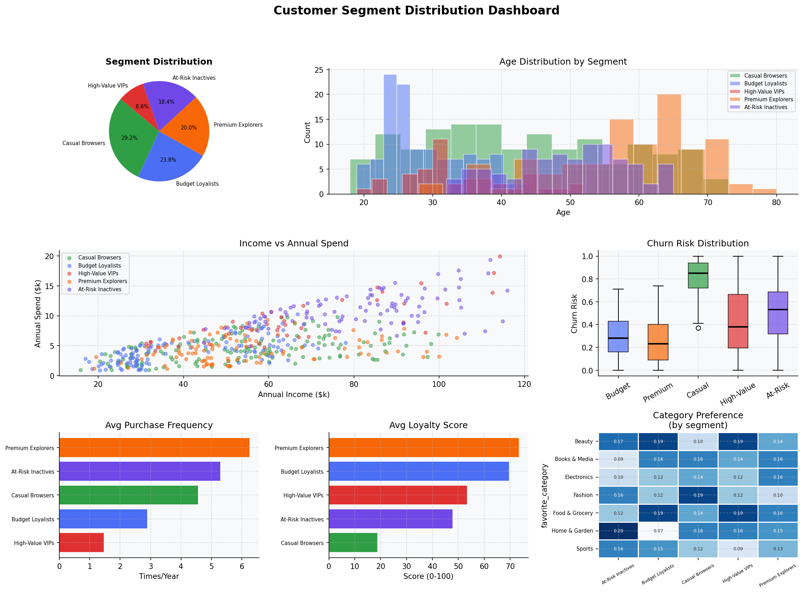
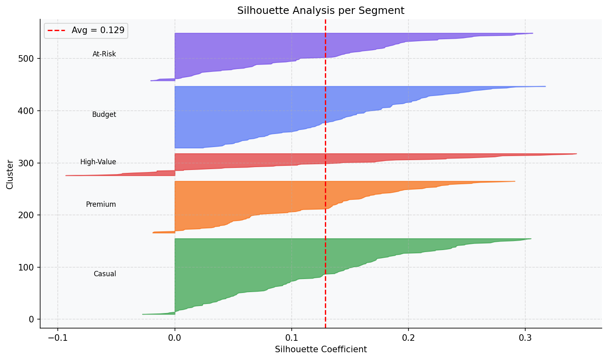

# Customer Segmentation Dashboard

A customer segmentation dashboard project built using Python and Data Analytics techniques.

## Features
- Customer data analysis
- Segmentation visualization
- Dashboard insights
- Interactive reports
- ## Dashboard Preview

### PCA Clusters

### Dashboard

### Silhouette Analysis

## Technologies Used
- Python
- Pandas
- Matplotlib
- Streamlit / Power BI

## Author
Meenakshi.R
